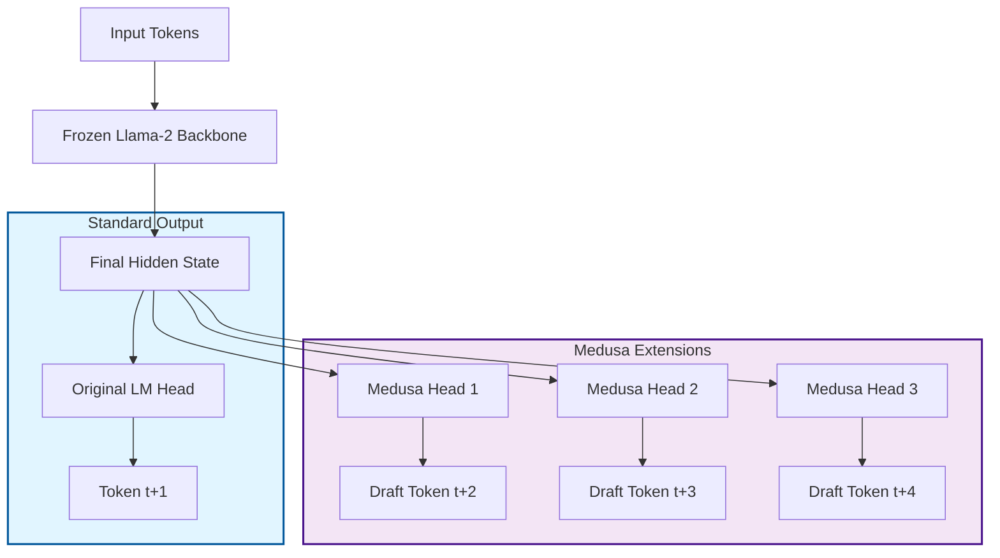
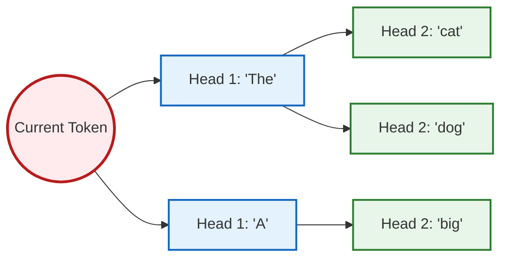

# 🐍 Medusa-Llama: Speculative Decoding with QLoRA Self-Distillation

## 🚀 Overview

This repository contains a PyTorch implementation of **Medusa**, a speculative decoding framework that accelerates Large Language Model (LLM) inference by roughly **2x-3x** without compromising generation quality.

Unlike standard speculative decoding which requires a separate "Draft Model" (increasing VRAM usage), Medusa attaches multiple lightweight "Heads" to the same backbone model.

### Key Features of this Implementation

- **QLoRA Integrated:** Supports training on consumer GPUs (Colab T4/A100) using 4-bit quantization.
- **Self-Distillation:** Implements a memory-efficient training recipe where the "Teacher" is the frozen base model and the "Student" is the LoRA-adapted model—removing the need to load two full models into memory.
- **Tree Attention:** Implements a custom attention mask to verify multiple draft candidates in a single forward pass.

---

## 🧠 Architecture

### The Medusa Head Concept

Standard LLMs predict the next token t+1. Medusa adds extra MLPs to predict t+2, t+3, etc., from the current hidden state.



### Tree Verification (Inference)

During inference, we don't just guess one sequence. We generate a "Tree" of candidates and verify them all simultaneously using a specific Attention Mask.



---

## 🛠️ Installation

```bash
git clone https://github.com/yourusername/medusa-llama-qlora.git
cd medusa-llama-qlora
pip install torch transformers peft datasets bitsandbytes accelerate
```

---

## 🚦 Usage

### 1. Data Preprocessing

Prepare the WikiText-103 dataset (chunks and packs data for efficient training).

```bash
python preprocess_data.py --dataset_name wikitext --block_size 1024
```

### 2. Training (Self-Distillation)

This script runs the "Medusa-1" (Warmup) and "Medusa-2" (Joint Distillation) stages automatically. It uses QLoRA to keep memory usage under 16GB.

```bash
python train_kd.py \
    --student_name "NousResearch/Llama-2-7b-chat-hf" \
    --offsets 1 2 3 \
    --batch_size 4 \
    --epochs 3 \
    --qlora \
    --save_dir "experiments/medusa_run"
```

### 3. Accelerated Inference

Run the Tree Verification decoder to observe speedups.

```bash
python decode_tree.py \
    --base_model_id "NousResearch/Llama-2-7b-chat-hf" \
    --adapter_dir "experiments/medusa_run/best" \
    --mtp_ckpt_path "experiments/medusa_run/best/mtp_head.pt"
```

---

## 📈 Performance & Metrics

To benchmark Latency, Throughput (tokens/sec), and Wall-clock time:

```bash
python evaluate.py
```

**Note:** Speedups vary based on hardware. Tree-attention typically provides **1.8x - 2.5x speedup** on memory-bound GPUs (e.g., A100).
